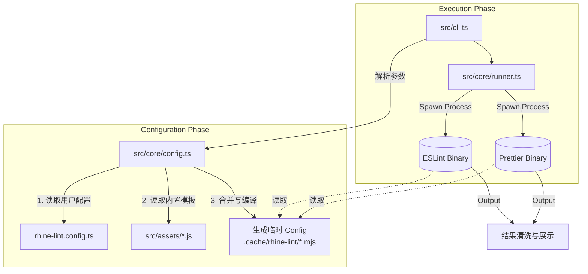

# Rhine Lint

<p align="center">
  
  
  
</p>

**Rhine Lint** 是一个「零配置」的现代化代码规范解决方案。它深度整合了 **ESLint (v9 Flat Config)** 与 **Prettier**，为你提供开箱即用的最佳实践。你无需再手动安装数十个 `eslint-plugin-*` 依赖，也无需编写数百行的配置文件。只需一个依赖，一行命令，即可获得顶级的代码质量守护。

## 特性 Features

- **零配置启动 Zero Config**: 默认提供适用于 TypeScript、React、Next.js 的最佳实践配置，安装即用。
- **统一工具链 Unified Toolchain**: 一个 `rl` 命令同时执行代码检查 (Lint) 和代码格式化 (Format)。
- **全栈支持 Full Stack**:
  - **JavaScript / TypeScript**: 完整的类型检查支持。
  - **Frontend**: React (v18/v19), React Hooks, JSX A11y.
  - **Frameworks**: Next.js (Pages & App Router).
  - **Styles**: CSS, SCSS format supports.
  - **Others**: JSON, Markdown support.
- **智能配置生成 Smart Config**: 运行时动态生成配置文件，无需担心 ESLint/Prettier 配置文件污染项目根目录。
- **灵活扩展 Extensible**: 支持 `rhine-lint.config.ts` 进行规则覆盖或深度定制。

## 安装 Installation

在你的项目中作为开发依赖安装：

```bash
# Bun (Recommended)
bun add -D rhine-lint

# npm
npm install --save-dev rhine-lint

# pnpm
pnpm add -D rhine-lint

# yarn
yarn add -D rhine-lint
```

## 快速开始 Quick Start

### 命令行使用 (CLI)

安装完成后，你可以直接使用 `rl` 命令：

```bash
# 检查当前目录下所有文件 (默认 lint + check format)
npx rl

# 自动修复所有可修复的代码风格问题
npx rl --fix

# 检查指定文件或目录
npx rl src/components

# 指定项目类型 (覆盖自动检测或默认值)
npx rl --level nextjs
```

### 推荐配置

在 `package.json` 中添加 scripts，方便日常使用：

```json
{
  "scripts": {
    "lint": "rl",
    "lint:fix": "rl --fix"
  }
}
```

## 配置 Configuration

虽然 Rhine Lint 是零配置的，但也支持通过配置文件进行深度定制。它会自动检测项目根目录下的 `rhine-lint.config.{ts,js,mjs,json}`。

### 配置文件示例 (`rhine-lint.config.ts`)

```typescript
import { type Config } from 'rhine-lint';

export default {
  // 指定项目级别: 'js' | 'ts' | 'frontend' | 'nextjs'
  // 默认为 'frontend'
  level: 'nextjs',

  // 是否默认开启修复模式 (可选)
  fix: false, 
  
  // 自定义缓存目录 (可选)
  // cacheDir: './.cache/rhine-lint',

  // ESLint 专项配置
  eslint: {
    // 启用/禁用特定范围的规则
    scope: {
      frontend: true,      // 开启前端规则 (React 等)
      nextjs: true,        // 开启 Next.js 规则
      imoprtX: true,       // 开启 Import 排序等规则
    },
    
    // 自定义 ESLint 规则 (Flat Config 格式)
    // 这里的配置会与默认配置合并
    config: [
      {
        rules: {
          'no-console': 'warn',
          'react/no-unknown-property': 'off'
        }
      }
      // ...
    ]
  },

  // Prettier 专项配置
  prettier: {
    config: {
      printWidth: 100,
      semi: true,
      // ...
    }
  }
} as Config;
```

### 参数说明 (Arguments)

CLI 参数优先级高于配置文件：

- `--fix`: 自动修复错误。
- `--config <path>`: 指定配置文件路径。
- `--level <level>`: 强制指定项目类型（`js`, `ts`, `frontend`, `nextjs`）。
- `--ignore <pattern>`: 添加忽略模式 (支持多次使用, e.g. `--ignore dist --ignore coverage`)。
- `--no-ignore`: 强制禁用所有忽略规则 (包括 .gitignore)。
- `--debug`: 打印调试信息（包括生成的配置、忽略列表等）。
- `--cache-dir <dir>`: 指定缓存目录（默认使用 `node_modules/.cache/rhine-lint`）。

### 缓存目录 Cache Directory

Rhine Lint 需要一个目录来存放运行时动态生成的 "Virtual Config" 文件。这些文件是临时的，通常不需要用户关心。
缓存目录的解析优先级如下（由高到低）：

1. **CLI 参数**: 命令行中显式指定 `--cache-dir <path>`。
2. **配置文件**: `rhine-lint.config.ts` 中的 `cacheDir` 字段。
3. **默认位置 (标准)**: `node_modules/.cache/rhine-lint`（如果项目中有 `node_modules` 目录）。
4. **回退位置**: `.cache/rhine-lint`（如果找不到 `node_modules`，则在项目根目录下创建）。

> **注意**: 如果你的项目触发了第 4 种情况（回退位置），建议将 `.cache/` 添加到你的 `.gitignore` 文件中，以免这些临时文件被提交到版本库。正常情况下，Rhine Lint 会在执行结束后尝试清理这些临时文件，但保留在 `.gitignore` 中是更安全的做法。

## 项目级别 Project Levels

Rhine Lint 根据 `level` 参数加载不同的规则集：

- **`js`**: 基础 JavaScript 项目。仅包含标准 JS 规则和 Prettier。
- **`ts`**: TypeScript 项目。包含 TS 类型检查规则、TSDoc 等。
- **`frontend`** (默认): 前端 React 项目。包含 `ts` 级别所有规则，加上 `React`, `React Hooks`, `JSX` 相关规则。
- **`nextjs`**: Next.js 项目。包含 `frontend` 级别所有规则，加上 `@next/eslint-plugin-next` 的 Core Web Vitals 等规则。

## 技术实现与原理 Implementation Insights

本章节详细阐述 **Rhine Lint** 的内部工作机制。如果你希望为本项目贡献代码，或者想深度定制功能，可以通过以下内容快速上手。

Rhine Lint 的核心本质是一个 **Configuration Factory (配置工厂)** 与 **Execution Orchestrator (执行编排器)**。它并没有重写 Linter，而是站在巨人的肩膀上（ESLint & Prettier），通过一层薄封装来解决配置复杂性问题。

### 1. 核心架构 Core Architecture

整个执行流程可以分为三个阶段：**初始化 (Init)** -> **生成 (Generate)** -> **执行 (Execute)**。



### 2. 模块详解 Module Deep Dive

#### CLI 入口 (`src/cli.ts`)
- **职责**: 程序的入口点。
- **实现**: 使用 `cac` 库处理命令行参数（如 `--fix`, `--level`）。
- **逻辑**: 
  1. 它不会直接调用 ESLint API，而是准备好环境路径。
  2. 调用 `generateTempConfig` 准备配置文件。
  3. 调用 `runEslint` 和 `runPrettier` 启动子进程。
  4. 最终根据子进程的 exit code 决定 `rl` 命令是成功还是失败。

#### 配置生成器 (`src/core/config.ts`) 🔥核心
这是项目最复杂的部分。为了实现「零配置」且不污染用户目录，我们采用 **虚拟配置 (Virtual Configuration)** 策略。

- **动态生成**: 我们不依赖用户项目里的 `.eslintrc`。相反，我们在运行时，在 `node_modules/.cache/rhine-lint/` 下生成一个真实的 `eslint.config.mjs`。
- **TypeScript 配置编译 (TS Compilation)**: 如果检测到用户的配置文件是 `.ts` 格式：
  - 会自动调用内置的 TypeScript 编译器将其转译为 `.mjs` 模块。
  - 转译后的文件被保存在缓存目录（如 `.cache/rhine-lint/rhine-lint.user-config.mjs`）。
  - 生成的 ESLint 配置会指向这个编译后的 JS 文件，从而解决 Node.js 原生无法加载 TS 文件的限制。
- **智能缓存 (Smart Caching)**: 为了提高性能（尤其是 IDE 保存自动修复时），我们实现了一套基于指纹的缓存机制：
  - **指纹计算**: 每次运行前会计算一个 SHA-256 哈希，包含：`package.json` 版本 + CLI 参数 + 用户配置文件内容 + `.gitignore` 状态。
  - **极速命中**: 如果指纹与缓存的 `metadata.json` 匹配，则**完全跳过**繁重的转译、合并和文件写入操作，直接复用上次的配置。
- **JIT 加载**: 除了上述静态编译，对于部分模块加载我们使用 `jiti` 确保兼容性。
- **关键点**: 这种设计使得 `rhine-lint` 内部的依赖（如 `eslint-plugin-react`）可以被正确解析，而不需要用户显式安装它们。

#### 规则资产 (`src/assets/`)
这里存放了 Lint 规则的「源头」。

- **`eslint.config.js`**: 这是一个 **Factory Function**。它导出一个 `createConfig(options)` 函数。
  - **Flat Config**: 采用了 ESLint v9 的 Flat Config 数组格式。
  - **按需加载**: 根据传入的 `options.level` (如 `frontend` 或 `nextjs`)，它会动态 `push` 不同的配置块（Block）到数组中。例如，只有在 `nextjs` 模式下，才会加载 `@next/eslint-plugin-next` 相关规则。
  - **插件集成**: 所有插件（`react`, `import-x`, `unused-imports` 等）都在这里被引入并配置。

#### 执行引擎 (`src/core/runner.ts`)
- **进程隔离**: 我们使用 Node.js 的 `child_process.spawn` 来调用 `eslint` 和 `prettier` 的可执行文件。
- **为什么不使用 API?**: 
  - 使用 API (如 `new ESLint()`) 可能会导致单例冲突，或者在某些边缘情况下与 CLI 行为不一致。
  - 通过 spawn 调用 CLI 能够最大程度保证兼容性，并且利用多核 CPU 并行运行 Lint 和 Prettier。
- **输出清洗**: 原生的 ESLint 输出对于普通用户来说可能太过冗长。我们在这一层捕获 stdout/stderr，移除了 ANSI 乱码，并提取出关键的 "X problems found" 摘要信息，给用户最直观的反馈。

### 3. 开发指引 Development Guide

如果你想为 Rhine Lint 添加新功能，请遵循以下路径：

#### 添加一个新的 ESLint 插件
1. **安装依赖**: 在 `rhine-lint` 项目中安装插件，例如 `bun add eslint-plugin-vue`。
2. **注册插件**: 修改 `src/assets/eslint.config.js`。
   - 导入插件。
   - 在 `createConfig` 函数中，添加新的逻辑分支（例如 `if (OPTIONS.ENABLE_VUE) { ... }`）。
   - 定义好 `plugins` 和 `rules`。
3. **更新类型**: 在 `src/config.ts` 的 `Config` 类型定义中添加新的 Scope 开关。
4. **测试**: 在 `playground` 目录中创建一个 Vue 文件，运行 `bun start --level vue` (假设你添加了 vue level) 进行验证。

#### 调试 (Debugging)
本项目完全使用 TypeScript 编写。

- **Build**: `bun run build` (使用 `tsc` 编译到 `dist/`)。
- **Link**: 在本项目根目录运行 `npm link`，然后在测试项目运行 `npm link rhine-lint`。
- **Watch**: 也可以使用 `bun run dev` (如果配置了) 或手动监听文件变化。

### 4. 目录结构

```text
rhine-lint/
├── src/
│   ├── assets/              # 默认的配置文件模板 (ESLint/Prettier)
│   ├── core/
│   │   ├── config.ts        # 配置加载与临时文件生成逻辑
│   │   └── runner.ts        # 子进程执行器
│   ├── utils/               # 工具函数 (Logger 等)
│   ├── cli.ts               # 命令行入口
│   ├── config.ts            # 类型定义
│   └── index.ts             # 导出给用户的 API
├── scripts/                 # 构建脚本
└── package.json
```

---

## License

MIT © [RhineAI](https://github.com/RhineAI)
