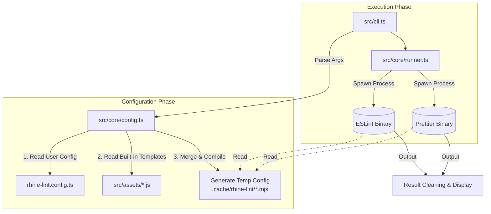

<p align="center">
  
  
  
</p>

**Rhine Lint** is a "zero-config" modern code linting solution. It deeply integrates **ESLint (v9 Flat Config)** and **Prettier**, providing out-of-the-box best practices. No need to manually install dozens of `eslint-plugin-*` dependencies or write hundreds of lines of configuration. Just one dependency, one command, and you get top-tier code quality protection.

## Features

- **Zero Config**: Provides best practice configurations for TypeScript, React, and Next.js by default. Ready to use upon installation.
- **Unified Toolchain**: A single `rl` command executes both code linting (Lint) and code formatting (Format).
- **Full Stack Support**:
  - **JavaScript / TypeScript**: Complete type checking support.
  - **Frontend**: React (v18/v19), React Hooks, JSX A11y.
  - **Frameworks**: Next.js (Pages & App Router).
  - **Styles**: CSS, SCSS format support.
  - **Others**: JSON, Markdown support.
- **Smart Config Generation**: Dynamically generates configuration files at runtime, keeping your project root clean from ESLint/Prettier config files.
- **Extensible**: Supports `rhine-lint.config.ts` for rule overrides or deep customization.

## Installation

Install as a dev dependency in your project:

```bash
# Bun (Recommended)
bun add -D rhine-lint

# npm
npm install --save-dev rhine-lint

# pnpm
pnpm add -D rhine-lint

# yarn
yarn add -D rhine-lint
```

## Quick Start

### Initialize Configuration

The quickest way to get started is using the `rl init` command:

```bash
rl init
```

This interactive wizard will:
1. **Detect project features** - Automatically scans `package.json` for TypeScript, React, Next.js, Sass
2. **Configure options** - Prompts you to confirm or customize:
   - Project level (normal/react/next)
   - TypeScript support
   - Project-based type checking
3. **Generate config file** - Creates `rhine-lint.config.ts` (or `.js` for non-TypeScript projects)
4. **Add npm scripts** - Optionally adds `lint` and `lint:fix` scripts to `package.json`
5. **Pre-generate configs** - Generates ESLint and Prettier configurations for faster first run

Example output:
```
+------------------------------------------------+
|                                                |
|                  Rhine Lint                    |
|           Zero-config linting solution         |
|                                                |
+------------------------------------------------+

[1/4] Detecting project features...

  • TypeScript: ✓
  • React: ✓
  • Next.js: ✗
  • Sass/SCSS: ✗
  • Recommended level: React

--------------------------------------------------

[2/4] Configure options

  ? Use detected level react? [Y/N]
  ? Enable TypeScript support? [Y/N]
  ? Enable project-based type checking? [Y/N]
  ? Add lint and lint:fix scripts to package.json? [Y/N]

--------------------------------------------------

[3/4] Generating configuration files...

RL Created rhine-lint.config.ts
RL Added lint and lint:fix scripts to package.json
RL Generated eslint.config.mjs
RL Generated prettier.config.mjs

--------------------------------------------------

[4/4] Configuration complete!

RL Configuration summary:
  • Level: react
  • TypeScript: enabled
  • Project Type Check: enabled
  • Scripts added: enabled

RL Run rl to lint your project.
RL Run rl --fix to auto-fix issues.
```

### CLI Usage

After installation, you can use the `rl` command directly:

```bash
# Initialize configuration interactively
rl init

# Generate config files (force regenerate, ignore cache)
rl config

# Check version
rl --version

# Check all files in current directory (default: lint + check format)
rl

# Auto-fix all fixable code style issues
rl --fix

# Check specific files or directories
rl src/components

# Specify project type (override auto-detection or default)
rl --level next
```

### Recommended Configuration

Add scripts to `package.json` for daily use:

```json
{
  "scripts": {
    "lint": "rl",
    "lint:fix": "rl --fix"
  }
}
```

## Configuration

Although Rhine Lint is zero-config, it also supports deep customization through configuration files. It automatically detects `rhine-lint.config.{ts,js,mjs,json}` in the project root directory.

### Configuration File Example (`rhine-lint.config.ts`)

```typescript
import { type Config } from 'rhine-lint';

export default {
  // Specify project level: 'normal' | 'react' | 'next'
  // Default is 'react'
  level: 'next',

  // Enable TypeScript support (optional)
  // true: Enable TypeScript rules (TS, TSX files)
  // false: JavaScript mode (JS, JSX files)
  // Default is true
  typescript: true,

  // Enable fix mode by default (optional)
  fix: false,

  // Custom cache directory (optional)
  // cacheDir: './.cache/rhine-lint',

  // Enable project-based type checking (optional)
  // When enabled, uses projectService and strictTypeChecked rules
  // Slower but more accurate type-aware linting
  // Set to false to disable for faster single-file processing
  // Default is true
  projectTypeCheck: true,

  // Specify tsconfig file path (optional)
  // Used for TypeScript type checking and import path resolution
  // Can be absolute or relative to project root
  // Default is './tsconfig.json'
  tsconfig: './tsconfig.app.json',

  // Additional ignore patterns (optional)
  // These patterns are merged with .gitignore and default ignores
  ignores: ['temp', 'generated', '*.test.ts'],

  // ESLint specific configuration
  eslint: {
    // Enable ESLint (default is true)
    // Set to false to disable ESLint checking
    enable: true,

    // Copy generated config to project root for IDE integration (optional)
    // Useful when your IDE cannot detect configs in cache directory
    copyConfigFileTo: './eslint.config.mjs',

    // Custom ESLint rules (Flat Config format)
    // These configurations are merged with defaults
    config: [
      {
        rules: {
          'no-console': 'warn',
          'react/no-unknown-property': 'off'
        }
      }
      // ...
    ]
  },

  // Prettier specific configuration
  prettier: {
    // Enable Prettier (default is true)
    // Set to false to disable Prettier format checking
    enable: true,

    // Copy generated config to project root for IDE integration (optional)
    copyConfigFileTo: './prettier.config.mjs',

    config: {
      printWidth: 100,
      semi: true,
      // ...
    }
  }
} as Config;
```

### Arguments

CLI arguments take priority over configuration file:

- `--fix`: Auto-fix errors.
- `--no-fix`: Disable auto-fix (overrides `fix: true` in config file).
- `--config <path>`: Specify configuration file path.
- `--level <level>`: Force project level (`normal`, `react`, `next`).
- `--no-typescript`: Disable TypeScript support, use JavaScript mode.
- `--no-project-type-check`: Disable project-based type checking (can speed up single-file processing).
- `--tsconfig <path>`: Specify tsconfig file path (for type checking and import resolution).
- `--ignore-file <path>`: Specify gitignore-style ignore file (can be used multiple times, e.g. `--ignore-file .gitignore --ignore-file .eslintignore`).
- `--ignore <pattern>`: Add ignore pattern (can be used multiple times, e.g. `--ignore dist --ignore coverage`).
- `--no-ignore`: Force disable all ignore rules (including ignoreFiles and ignores).
- `--only-eslint`: Only run ESLint, skip Prettier.
- `--only-prettier`: Only run Prettier, skip ESLint.
- `--no-time`: Disable elapsed time display (enabled by default).
- `--debug`: Print debug information (including generated configs, ignore lists, etc.).
- `--cache-dir <dir>`: Specify cache directory (default uses `node_modules/.cache/rhine-lint`).

### TypeScript Configuration Options

#### projectTypeCheck

Controls whether to enable project-based TypeScript type checking:

- **When enabled (default)**: Uses `projectService` and `strictTypeChecked` rules, providing more accurate type-aware linting, but slower.
- **When disabled**: Uses a lighter ruleset, suitable for fast single-file checks or CI environments.

```bash
# Disable project type checking (CLI)
rl --no-project-type-check

# Set in configuration file
# rhine-lint.config.ts
export default {
  projectTypeCheck: false
}
```

#### tsconfig

Specify the tsconfig file for TypeScript type checking and import path resolution:

```bash
# Specify tsconfig path (CLI)
rl --tsconfig ./tsconfig.app.json

# Set in configuration file
# rhine-lint.config.ts
export default {
  tsconfig: './tsconfig.app.json'
}
```

Default is `./tsconfig.json`. If your project uses different tsconfig files (like `tsconfig.app.json`, `tsconfig.node.json`, etc.), you can specify them via this option.

### Ignore Patterns

Rhine Lint provides flexible file ignore mechanisms with multiple configuration methods.

#### Default Ignores

The following directories are always ignored (no configuration needed):
- `node_modules`, `dist`, `.next`, `.git`, `.output`, `.nuxt`, `coverage`, `.cache`

The following files are ignored by default (can be overridden by configuration):
- `package-lock.json`, `yarn.lock`, `pnpm-lock.yaml`, `bun.lock`

#### ignoreFiles

Rhine Lint automatically parses `.gitignore`-style files, converting patterns to ESLint ignore rules.

**Default value**: `['./.gitignore']`

```bash
# CLI: Specify ignore files (overrides default, supports multiple uses)
rl --ignore-file .gitignore --ignore-file .eslintignore
```

```typescript
// rhine-lint.config.ts
export default {
  // Specify list of ignore files to read
  ignoreFiles: ['./.gitignore', './.eslintignore']
}
```

#### ignores

Directly specify file or directory patterns to ignore.

**Default value**: `['package-lock.json', 'yarn.lock', 'pnpm-lock.yaml', 'bun.lock']`

```bash
# CLI: Add ignore patterns (merged with config file, supports multiple uses)
rl --ignore temp --ignore generated --ignore "*.test.ts"
```

```typescript
// rhine-lint.config.ts
export default {
  // Specify file/directory patterns to ignore
  ignores: ['temp', 'generated', '*.test.ts']
}
```

#### Disable Ignores --no-ignore

```bash
# Disable all ignore rules (including ignoreFiles and ignores)
rl --no-ignore
```

#### Ignore Pattern Priority

1. `--no-ignore` disables all ignore processing
2. Otherwise, merged in the following order:
   - Default always-ignored directories (always active)
   - Parsed results from files in `ignoreFiles`
   - `ignores` pattern list

**Priority rules**:
- `--ignore-file`: When specified via CLI, overrides `ignoreFiles` in config file
- `--ignore`: When specified via CLI, overrides `ignores` in config file
- Final results of both `ignoreFiles` and `ignores` take effect (merged)

### Cache Directory

Rhine Lint needs a directory to store dynamically generated "Virtual Config" files at runtime. These files are temporary and typically don't require user attention.
Cache directory resolution priority (high to low):

1. **CLI argument**: Explicitly specified via `--cache-dir <path>` in command line.
2. **Config file**: `cacheDir` field in `rhine-lint.config.ts`.
3. **Default location (standard)**: `node_modules/.cache/rhine-lint` (if project has `node_modules` directory).
4. **Fallback location**: `.cache/rhine-lint` (created in project root if `node_modules` is not found).

> **Note**: If your project triggers case 4 (fallback location), it's recommended to add `.cache/` to your `.gitignore` to prevent these temporary files from being committed to version control. Normally, Rhine Lint attempts to clean up these temporary files after execution, but keeping them in `.gitignore` is a safer practice.

## Project Levels

Rhine Lint loads different rulesets based on `level` and `typescript` parameters.

### Auto Detection

When `level` is not specified, Rhine Lint automatically analyzes `dependencies` and `devDependencies` in `package.json`:
- Detected `next` dependency → uses `level: 'next'`
- Detected `react` dependency → uses `level: 'react'`
- Cannot detect → warns and uses `level: 'normal'`

### Level Options

- **`normal`**: Basic project. Only includes standard rules and Prettier.
- **`react`**: React frontend project. Includes all `normal` level rules, plus `React`, `React Hooks`, `JSX` related rules.
- **`next`**: Next.js project. Includes all `react` level rules, plus `@next/eslint-plugin-next` Core Web Vitals and other rules.

### TypeScript Options

- **`typescript: true`** (default): Enables TypeScript rules, supports `.ts`, `.tsx` files, includes type checking rules.
- **`typescript: false`**: JavaScript mode, supports `.js`, `.jsx` files, no type checking.

### Combination Examples

| level | typescript | Description |
|-------|------------|-------------|
| `normal` | `true` | TypeScript basic project |
| `normal` | `false` | JavaScript basic project |
| `react` | `true` | TypeScript + React project |
| `react` | `false` | JavaScript + React project |
| `next` | `true` | TypeScript + React + Next.js project |
| `next` | `false` | JavaScript + React + Next.js project |

## Trigger Fix when Save

### VS Code (Cursor, Antigravity, ...)

#### Step 0: Preparation
1. Make sure RhineLint is installed in the project with command `bun add -D rhine-lint`
2. Run `rl init` in the project root directory to initialize and configure your rules (optional)

#### Step 1: Configure Prettier Fix on Save

1. Run `rl config` to generate config files in cache
2. Create `prettier.config.js` in project root and write:
```javascript
export { default } from './node_modules/.cache/rhine-lint/prettier.config.mjs'
```
Since VS Code's Prettier extension cannot directly specify config file path in cache directory yet, we need to manually point to rhine-lint's cache config file.

3. Install Prettier extension: `esbenp.prettier-vscode`
4. Add to `.vscode/settings.json`:

```json
{
  "editor.defaultFormatter": "esbenp.prettier-vscode",
  "editor.formatOnSave": true,
  "[javascript]": {
    "editor.defaultFormatter": "esbenp.prettier-vscode"
  },
  "[javascriptreact]": {
    "editor.defaultFormatter": "esbenp.prettier-vscode"
  },
  "[typescript]": {
    "editor.defaultFormatter": "esbenp.prettier-vscode"
  },
  "[typescriptreact]": {
    "editor.defaultFormatter": "esbenp.prettier-vscode"
  },
  "[json]": {
    "editor.defaultFormatter": "esbenp.prettier-vscode"
  },
  "[css]": {
    "editor.defaultFormatter": "esbenp.prettier-vscode"
  },
  "[scss]": {
    "editor.defaultFormatter": "esbenp.prettier-vscode"
  },
  "[markdown]": {
    "editor.defaultFormatter": "esbenp.prettier-vscode"
  }
}
```

#### Step 2: Configure ESLint Fix on Save

1. Install ESLint extension: `dbaeumer.vscode-eslint`
2. Add to `.vscode/settings.json`:

```json
{
  "eslint.enable": true,
  "eslint.options": {
    "overrideConfigFile": "./node_modules/.cache/rhine-lint/eslint.config.mjs"
  },
  "editor.codeActionsOnSave": {
    "source.fixAll.eslint": "explicit"
  }
}
```

### JetBrains IDE (WebStorm, IDEA, PyCharm, ...)

#### Step 0: Preparation
1. Make sure RhineLint is installed in the project with command `bun add -D rhine-lint`
2. Run `rl init` in the project root directory to initialize and configure your rules (optional)

#### Step 1: Configure Prettier Fix on Save

1. Run `rl config` to generate config files in cache
2. Create `prettier.config.js` in project root and write:

```javascript
export { default } from './node_modules/.cache/rhine-lint/prettier.config.mjs'
```
Since `JetBrains IDE`'s built-in Prettier save trigger tool cannot specify config file path yet, we need to manually point to rhine-lint's cache config file.

3. Open `File` → `Settings` → `Languages & Frameworks` → `JavaScript` → `Prettier`
4. Select `Manual Prettier configuration`
5. In `Prettier package`, select path `{project-path}\node_modules\prettier`
6. In `Path to .prettierignore`, you can select your `.gitignore` file
7. Check `Run on 'Reformat Code' action`
8. Check `Run on save`
9. Check `Run on paste`

#### Step 2: Configure ESLint Fix on Save

1. Open `File` → `Settings` → `Languages & Frameworks` → `JavaScript` → `Code Quality Tools` → `ESLint`
2. Select `Manual ESLint configuration`
3. In `ESLint package`, select path `{project-path}\node_modules\eslint`
4. In `Working directories`, select your project path
5. In `Configuration File`, select path `{project-path}\node_modules\.cache\rhine-lint\eslint.config.mjs`
6. Check `Run eslint --fix on save`

## Implementation Insights

This chapter details the internal working mechanism of **Rhine Lint**. If you want to contribute to this project or deeply customize functionality, you can get started quickly with the following content.

Rhine Lint's core essence is a **Configuration Factory** and **Execution Orchestrator**. It doesn't rewrite a Linter but stands on the shoulders of giants (ESLint & Prettier), solving configuration complexity through a thin wrapper.

### 1. Core Architecture

The entire execution flow can be divided into three phases: **Init** -> **Generate** -> **Execute**.



### 2. Module Deep Dive

#### CLI Entry (`src/cli.ts`)
- **Responsibility**: The program's entry point.
- **Implementation**: Uses the `cac` library to handle command-line arguments (like `--fix`, `--level`).

##### CLI Options Definition

```typescript
cli
  .command("[...files]", "Lint files")
  .option("--fix", "Fix lint errors")
  .option("--config <path>", "Path to config file")
  .option("--level <level>", "Project level (normal, react, next)")
  .option("--no-typescript", "Disable TypeScript support (JavaScript only mode)")
  .option("--no-project-type-check", "Disable project-based type checking")
  .option("--tsconfig <path>", "Path to tsconfig file")
  .option("--ignore-file [path]", "Add gitignore-style file (can be used multiple times)")
  .option("--ignore [pattern]", "Add ignore pattern (can be used multiple times)")
  .option("--no-ignore", "Disable all ignore rules")
  .option("--cache-dir <dir>", "Custom cache directory")
  .option("--no-time", "Disable elapsed time display")
  .option("--only-eslint", "Only run ESLint (skip Prettier)")
  .option("--only-prettier", "Only run Prettier (skip ESLint)")
  .option("--debug", "Enable debug mode")
```

##### Key Logic

```typescript
// --ignore parameter handling (supports multiple calls)
// cac automatically collects multiple --ignore into an array
// --no-ignore sets options.ignore = false
const noIgnore = options.ignore === false;
let ignorePatterns: string[] = [];
if (!noIgnore && options.ignore && options.ignore !== true) {
  ignorePatterns = Array.isArray(options.ignore)
    ? options.ignore.filter((p: unknown) => typeof p === 'string')
    : [options.ignore];
}
// --ignore-file parameter handling
let ignoreFiles: string[] = [];
if (!noIgnore && options.ignoreFile && options.ignoreFile !== true) {
  ignoreFiles = Array.isArray(options.ignoreFile)
    ? options.ignoreFile.filter((p: unknown) => typeof p === 'string')
    : [options.ignoreFile];
}
```

- **Logic**:
  1. It doesn't call the ESLint API directly, but prepares environment paths.
  2. Calls `generateTempConfig` to prepare configuration files.
  3. Calls `runEslint` and `runPrettier` to start subprocesses.
  4. Finally determines whether the `rl` command succeeds or fails based on subprocess exit codes.

#### Configuration Generator (`src/core/config.ts`) - Core
This is the most complex part of the project. To achieve "zero-config" without polluting the user's directory, we adopt a **Virtual Configuration** strategy.

##### Function Signature

```typescript
export async function generateTempConfig(
    cwd: string,                              // Project root directory
    userConfigResult: { config: Config, path?: string },  // User config
    cliLevel?: string,                        // --level argument
    cliCacheDir?: string,                     // --cache-dir argument
    debug?: boolean,                          // --debug argument
    cliProjectTypeCheck?: boolean,            // --no-project-type-check
    cliTsconfig?: string,                     // --tsconfig argument
    cliIgnorePatterns: string[] = [],         // --ignore argument (array)
    noIgnore: boolean = false,                // --no-ignore argument
    cliIgnoreFiles: string[] = []             // --ignore-file argument (array)
): Promise<{ eslintPath: string; prettierPath: string; cachePath: string }>
```

##### Core Flow

1. **Parameter Priority Handling**: CLI arguments > Config file > Defaults
   ```typescript
   const projectTypeCheck = cliProjectTypeCheck ?? userConfigResult.config.projectTypeCheck ?? true;
   const tsconfigPath = cliTsconfig ?? userConfigResult.config.tsconfig;
   // ignoreFiles: CLI overrides config overrides default
   const resolvedIgnoreFiles = cliIgnoreFiles.length > 0
       ? cliIgnoreFiles
       : (userConfigResult.config.ignoreFiles ?? DEFAULT_IGNORE_FILES);
   // ignores: CLI overrides config overrides default
   const resolvedIgnores = cliIgnorePatterns.length > 0
       ? cliIgnorePatterns
       : (configIgnores.length > 0 ? configIgnores : DEFAULT_IGNORES);
   // Final ignoreFiles and ignores both take effect
   ```

2. **Smart Caching (SHA-256 Fingerprint)**:
   ```typescript
   const hash = createHash("sha256");
   hash.update(pkg.version || "0.0.0");
   hash.update(cliLevel || "default");
   hash.update(projectTypeCheck ? "ptc-on" : "ptc-off");
   hash.update(tsconfigPath || "default-tsconfig");
   hash.update(resolvedIgnoreFiles.join(",") || "no-ignore-files");
   hash.update(resolvedIgnores.join(",") || "no-ignores");
   hash.update(noIgnore ? "no-ignore" : "with-ignore");
   // + user config file content + each ignore file content
   ```

3. **Ignore Pattern Processing**:
   - If `--no-ignore`, skip all ignore processing
   - Otherwise:
     1. Add default always-ignored directories
     2. Parse all files in `ignoreFiles`
     3. Add `ignores` pattern list
   - Pattern normalization: Automatically adds `**/` prefix and `/**` suffix

4. **Generate Virtual Config**: Dynamically generates `eslint.config.mjs` content, including:
   - Ignore pattern array
   - User config loading logic
   - Rules based on level

- **Dynamic Generation**: We don't rely on `.eslintrc` in the user's project. Instead, at runtime, we generate a real `eslint.config.mjs` in `node_modules/.cache/rhine-lint/`.
- **TypeScript Config Compilation**: If user's config file is detected as `.ts` format:
  - Automatically calls the built-in TypeScript compiler to transpile it to `.mjs` module.
  - The transpiled file is saved in the cache directory (like `.cache/rhine-lint/rhine-lint.user-config.mjs`).
  - The generated ESLint config points to this compiled JS file, solving the limitation that Node.js cannot natively load TS files.
- **Smart Caching**: To improve performance (especially for IDE save auto-fix), we implement a fingerprint-based caching mechanism:
  - **Fingerprint Calculation**: Before each run, calculates a SHA-256 hash including: `package.json` version + CLI arguments + user config file content + `.gitignore` status.
  - **Fast Hit**: If fingerprint matches the cached `metadata.json`, **completely skips** heavy transpilation, merging, and file write operations, directly reusing the previous config.
- **JIT Loading**: Besides static compilation above, we use `jiti` for some module loading to ensure compatibility.
- **Key Point**: This design allows dependencies inside `rhine-lint` (like `eslint-plugin-react`) to be resolved correctly without users explicitly installing them.

#### Rule Assets (`src/assets/eslint.config.js`)
This stores the "source" of Lint rules. It's a **Factory Function** that exports the `createConfig(options)` function.

##### OPTIONS Configuration

```javascript
const OPTIONS = {
  ENABLE_SCRIPT: true,                    // Enable TS/JS file processing
  ENABLE_TYPE_CHECKED: true,              // Enable type checking rules
  ENABLE_PROJECT_BASE_TYPE_CHECKED: true, // Enable project-level type checking (projectService)
  ENABLE_FRONTEND: true,                  // Enable React/JSX rules
  ENABLE_NEXT: false,                     // Enable Next.js rules
  ENABLE_MARKDOWN: true,                  // Enable Markdown rules
  ENABLE_JSON: true,                      // Enable JSON rules
  ENABLE_STYLESHEET: true,                // Enable CSS rules
  IGNORE_PRETTIER: true,                  // Disable rules conflicting with Prettier
  TSCONFIG_PATH: './tsconfig.json',       // tsconfig file path
  ...overrides                            // Runtime overrides
}
```

##### Config Block Assembly

```javascript
return [
  ...globalConfig,      // Global ignore config
  ...scriptConfig,      // TS/JS base rules + import-x + unused-imports
  ...frontendConfig,    // React/Next.js rules (conditionally loaded by level)
  ...cssConfig,         // CSS rules
  ...markdownConfig,    // Markdown rules
  ...jsonConfig,        // JSON/JSONC rules
  ...prettierConfig,    // eslint-config-prettier (disable conflicting rules)
  ...customConfig,      // Custom rule overrides
]
```

- **Flat Config**: Uses ESLint v9's Flat Config array format.
- **On-demand Loading**: Based on the passed `options.level` (like `frontend` or `nextjs`), it dynamically `push`es different config blocks to the array. For example, only in `nextjs` mode are `@next/eslint-plugin-next` related rules loaded.
- **Plugin Integration**: All plugins (`react`, `import-x`, `unused-imports`, etc.) are imported and configured here.

#### Execution Engine (`src/core/runner.ts`)

##### Core Functions

```typescript
// General command execution
async function runCommandWithOutput(
  command: string,
  args: string[],
  cwd: string
): Promise<{ output: string, code: number }>

// ESLint execution
async function runEslint(
  cwd: string,
  configPath: string,   // Generated virtual config path
  fix: boolean,
  files: string[]
): Promise<string | null>  // Returns error summary or null

// Prettier execution
async function runPrettier(
  cwd: string,
  configPath: string,
  fix: boolean,
  files: string[]
): Promise<string | null>
```

##### Binary Resolution Strategy

```typescript
function resolveBin(pkgName: string, binPathRelative: string): string {
  // 1. Try require.resolve (fastest)
  // 2. Fallback: traverse directories to find package.json
  // 3. Fallback: use system PATH
}
```

- **Process Isolation**: We use Node.js's `child_process.spawn` to call `eslint` and `prettier` executables.
- **Why Not Use API?**:
  - Using API (like `new ESLint()`) may cause singleton conflicts or behave inconsistently with CLI in some edge cases.
  - Calling CLI via spawn ensures maximum compatibility and leverages multi-core CPUs to run Lint and Prettier in parallel.
- **Output Cleaning**: Native ESLint output can be too verbose for regular users. At this layer, we capture stdout/stderr, remove ANSI noise, and extract the key "X problems found" summary to give users the most intuitive feedback.

### 3. Type Definitions (`src/config.ts`)

```typescript
export type Config = {
  /**
   * Project level, determines which rules to enable
   * Each level includes all rules from the previous level:
   * - 'normal': Base rules (JS or TS based on typescript option)
   * - 'react': Normal + React/JSX/Hooks rules
   * - 'next': React + Next.js rules
   * @default 'react'
   */
  level?: 'normal' | 'react' | 'next',
  /**
   * Enable TypeScript support and type-aware rules
   * - true: Enable TypeScript rules (TS, TSX files)
   * - false: JavaScript mode (JS, JSX files)
   * @default true
   */
  typescript?: boolean,
  /**
   * Directory to store generated virtual config files and cache metadata
   * @default 'node_modules/.cache/rhine-lint' or '.cache/rhine-lint'
   */
  cacheDir?: string,
  /**
   * Auto-fix lint errors and format issues
   * @default false
   */
  fix?: boolean,
  /**
   * Enable elapsed time output for each phase
   * @default true
   */
  time?: boolean,
  /**
   * Enable project-based TypeScript type checking
   * Enables projectService and strictTypeChecked rules
   * Slower but more accurate type-aware linting
   * @default true
   */
  projectTypeCheck?: boolean,
  /**
   * tsconfig file path
   * @default './tsconfig.json' or './tsconfig.app.json'
   */
  tsconfig?: string,
  /**
   * List of gitignore-style ignore files
   * @default ['./.gitignore']
   */
  ignoreFiles?: string[],
  /**
   * List of ignore patterns
   * @default ['package-lock.json', 'yarn.lock', 'pnpm-lock.yaml', 'bun.lock']
   */
  ignores?: string[],
  /** @deprecated Use ignores instead */
  ignore?: string[],
  eslint?: {
    /** Enable ESLint @default true */
    enable?: boolean,
    /** ESLint Flat Config array */
    config?: Linter.Config[],
    /** Override mode (true: completely override built-in config) */
    overlay?: boolean,
  },
  prettier?: {
    /** Enable Prettier @default true */
    enable?: boolean,
    /** Prettier config object */
    config?: PrettierConfig,
    /** Override mode (true: completely override built-in config) */
    overlay?: boolean,
  }
}
```

### 4. Development Guide

If you want to add new features to Rhine Lint, follow these paths:

#### Adding a New ESLint Plugin
1. **Install Dependency**: Install the plugin in the `rhine-lint` project, e.g., `bun add eslint-plugin-vue`.
2. **Register Plugin**: Modify `src/assets/eslint.config.js`.
   - Import the plugin.
   - In the `createConfig` function, add a new logic branch (e.g., `if (OPTIONS.ENABLE_VUE) { ... }`).
   - Define `plugins` and `rules`.
3. **Update Types**: Add the new Scope toggle in the `Config` type definition in `src/config.ts`.
4. **Test**: Create a Vue file in the `playground` directory, run `bun start --level vue` (assuming you added vue level) to verify.

#### Debugging
This project is written entirely in TypeScript.

- **Build**: `bun run build` (compiles with `tsc` to `dist/`).
- **Link**: Run `npm link` in the project root, then `npm link rhine-lint` in the test project.
- **Watch**: You can also use `bun run dev` (if configured) or manually watch file changes.

### 5. Directory Structure

```text
rhine-lint/
├── src/
│   ├── assets/              # Default config file templates (ESLint/Prettier)
│   ├── core/
│   │   ├── config.ts        # Config loading and temp file generation logic
│   │   └── runner.ts        # Subprocess executor
│   ├── utils/               # Utility functions (Logger, etc.)
│   ├── cli.ts               # Command-line entry
│   ├── config.ts            # Type definitions
│   └── index.ts             # API exports for users
├── scripts/                 # Build scripts
└── package.json
```

---

## License

MIT © [RhineAI](https://github.com/RhineAI)
