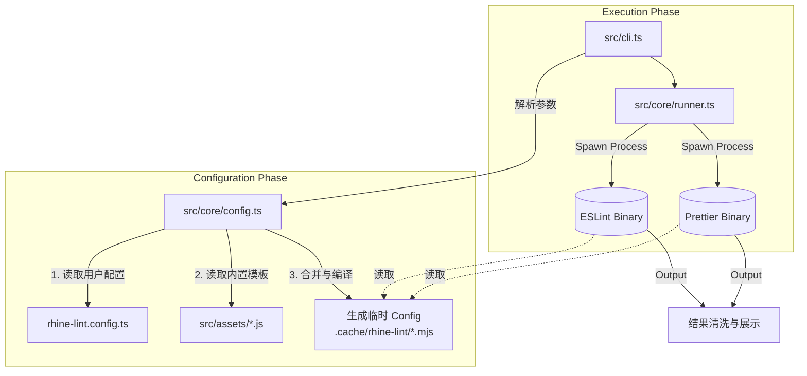

# Rhine Lint

<p align="center">
  
  
  
</p>

**Rhine Lint** 是一个「零配置」的现代化代码规范解决方案。它深度整合了 **ESLint (v9 Flat Config)** 与 **Prettier**，为你提供开箱即用的最佳实践。你无需再手动安装数十个 `eslint-plugin-*` 依赖，也无需编写数百行的配置文件。只需一个依赖，一行命令，即可获得顶级的代码质量守护。

## 特性 Features

- **零配置启动 Zero Config**: 默认提供适用于 TypeScript、React、Next.js 的最佳实践配置，安装即用。
- **统一工具链 Unified Toolchain**: 一个 `rl` 命令同时执行代码检查 (Lint) 和代码格式化 (Format)。
- **全栈支持 Full Stack**:
  - **JavaScript / TypeScript**: 完整的类型检查支持。
  - **Frontend**: React (v18/v19), React Hooks, JSX A11y.
  - **Frameworks**: Next.js (Pages & App Router).
  - **Styles**: CSS, SCSS format supports.
  - **Others**: JSON, Markdown support.
- **智能配置生成 Smart Config**: 运行时动态生成配置文件，无需担心 ESLint/Prettier 配置文件污染项目根目录。
- **灵活扩展 Extensible**: 支持 `rhine-lint.config.ts` 进行规则覆盖或深度定制。

## 安装 Installation

在你的项目中作为开发依赖安装：

```bash
# Bun (Recommended)
bun add -D rhine-lint

# npm
npm install --save-dev rhine-lint

# pnpm
pnpm add -D rhine-lint

# yarn
yarn add -D rhine-lint
```

## 快速开始 Quick Start

### 初始化配置

最快的入门方式是使用 `rl init` 命令：

```bash
rl init
```

这个交互式向导会：
1. **检测项目特性** - 自动扫描 `package.json` 检测 TypeScript、React、Next.js、Sass
2. **配置选项** - 提示你确认或自定义：
   - 项目级别 (normal/react/next)
   - TypeScript 支持
   - 基于项目的类型检查
3. **生成配置文件** - 创建 `rhine-lint.config.ts`（非 TypeScript 项目则为 `.js`）
4. **添加 npm scripts** - 可选择添加 `lint` 和 `lint:fix` 脚本到 `package.json`
5. **预生成配置** - 生成 ESLint 和 Prettier 配置，加快首次运行速度

示例输出：
```
+------------------------------------------------+
|                                                |
|                  Rhine Lint                    |
|           Zero-config linting solution         |
|                                                |
+------------------------------------------------+

[1/4] Detecting project features...

  • TypeScript: ✓
  • React: ✓
  • Next.js: ✗
  • Sass/SCSS: ✗
  • Recommended level: React

--------------------------------------------------

[2/4] Configure options

  ? Use detected level react? [Y/N]
  ? Enable TypeScript support? [Y/N]
  ? Enable project-based type checking? [Y/N]
  ? Add lint and lint:fix scripts to package.json? [Y/N]

--------------------------------------------------

[3/4] Generating configuration files...

RL Created rhine-lint.config.ts
RL Added lint and lint:fix scripts to package.json
RL Generated eslint.config.mjs
RL Generated prettier.config.mjs

--------------------------------------------------

[4/4] Configuration complete!

RL Configuration summary:
  • Level: react
  • TypeScript: enabled
  • Project Type Check: enabled
  • Scripts added: enabled

RL Run rl to lint your project.
RL Run rl --fix to auto-fix issues.
```

### 命令行使用 (CLI)

安装完成后，你可以直接使用 `rl` 命令：

```bash
# 查看版本
rl --version

# 检查当前目录下所有文件 (默认 lint + check format)
rl

# 自动修复所有可修复的代码风格问题
rl --fix

# 检查指定文件或目录
rl src/components

# 指定项目类型 (覆盖自动检测或默认值)
rl --level next
```

### 推荐配置

在 `package.json` 中添加 scripts，方便日常使用：

```json
{
  "scripts": {
    "lint": "rl",
    "lint:fix": "rl --fix"
  }
}
```

## 配置 Configuration

虽然 Rhine Lint 是零配置的，但也支持通过配置文件进行深度定制。它会自动检测项目根目录下的 `rhine-lint.config.{ts,js,mjs,json}`。

### 配置文件示例 (`rhine-lint.config.ts`)

```typescript
import { type Config } from 'rhine-lint';

export default {
  // 指定项目级别: 'normal' | 'react' | 'next'
  // 默认为 'react'
  level: 'next',

  // 是否启用 TypeScript 支持 (可选)
  // true: 启用 TypeScript 规则 (TS, TSX 文件)
  // false: JavaScript 模式 (JS, JSX 文件)
  // 默认为 true
  typescript: true,

  // 是否默认开启修复模式 (可选)
  fix: false,

  // 自定义缓存目录 (可选)
  // cacheDir: './.cache/rhine-lint',

  // 启用基于项目的类型检查 (可选)
  // 启用后会使用 projectService 和 strictTypeChecked 规则
  // 更慢但更准确的类型感知 lint
  // 设为 false 可禁用以加快单文件处理速度
  // 默认为 true
  projectTypeCheck: true,

  // 指定 tsconfig 文件路径 (可选)
  // 用于 TypeScript 类型检查和 import 路径解析
  // 可以是绝对路径或相对于项目根目录的路径
  // 默认为 './tsconfig.json'
  tsconfig: './tsconfig.app.json',

  // 额外的忽略模式 (可选)
  // 这些模式会与 .gitignore 和默认忽略合并
  ignores: ['temp', 'generated', '*.test.ts'],

  // ESLint 专项配置
  eslint: {
    // 是否启用 ESLint (默认为 true)
    // 设为 false 可禁用 ESLint 检查
    enable: true,

    // 自定义 ESLint 规则 (Flat Config 格式)
    // 这里的配置会与默认配置合并
    config: [
      {
        rules: {
          'no-console': 'warn',
          'react/no-unknown-property': 'off'
        }
      }
      // ...
    ]
  },

  // Prettier 专项配置
  prettier: {
    // 是否启用 Prettier (默认为 true)
    // 设为 false 可禁用 Prettier 格式检查
    enable: true,

    config: {
      printWidth: 100,
      semi: true,
      // ...
    }
  }
} as Config;
```

### 参数说明 (Arguments)

CLI 参数优先级高于配置文件：

- `--fix`: 自动修复错误。
- `--config <path>`: 指定配置文件路径。
- `--level <level>`: 强制指定项目级别（`normal`, `react`, `next`）。
- `--no-typescript`: 禁用 TypeScript 支持，使用 JavaScript 模式。
- `--no-project-type-check`: 禁用基于项目的类型检查 (可加快单文件处理速度)。
- `--tsconfig <path>`: 指定 tsconfig 文件路径 (用于类型检查和 import 解析)。
- `--ignore-file <path>`: 指定类似 `.gitignore` 的忽略文件 (支持多次使用, e.g. `--ignore-file .gitignore --ignore-file .eslintignore`)。
- `--ignore <pattern>`: 添加忽略模式 (支持多次使用, e.g. `--ignore dist --ignore coverage`)。
- `--no-ignore`: 强制禁用所有忽略规则 (包括 ignoreFiles 和 ignores)。
- `--only-eslint`: 只运行 ESLint，跳过 Prettier。
- `--only-prettier`: 只运行 Prettier，跳过 ESLint。
- `--no-time`: 禁用各阶段耗时信息显示（默认启用）。
- `--debug`: 打印调试信息（包括生成的配置、忽略列表等）。
- `--cache-dir <dir>`: 指定缓存目录（默认使用 `node_modules/.cache/rhine-lint`）。

### TypeScript 配置选项

#### projectTypeCheck

控制是否启用基于项目的 TypeScript 类型检查：

- **启用时 (默认)**: 使用 `projectService` 和 `strictTypeChecked` 规则，提供更准确的类型感知 lint，但速度较慢。
- **禁用时**: 使用更轻量的规则集，适合快速的单文件检查或 CI 环境。

```bash
# 禁用项目类型检查 (CLI)
rl --no-project-type-check

# 在配置文件中设置
# rhine-lint.config.ts
export default {
  projectTypeCheck: false
}
```

#### tsconfig

指定用于 TypeScript 类型检查和 import 路径解析的 tsconfig 文件：

```bash
# 指定 tsconfig 路径 (CLI)
rl --tsconfig ./tsconfig.app.json

# 在配置文件中设置
# rhine-lint.config.ts
export default {
  tsconfig: './tsconfig.app.json'
}
```

默认使用 `./tsconfig.json`。如果你的项目使用不同的 tsconfig 文件（如 `tsconfig.app.json`、`tsconfig.node.json` 等），可以通过此选项指定。

### 忽略模式 Ignore Patterns

Rhine Lint 提供了灵活的文件忽略机制，支持多种配置方式。

#### 默认忽略

以下目录始终被忽略（无需配置）：
- `node_modules`, `dist`, `.next`, `.git`, `.output`, `.nuxt`, `coverage`, `.cache`

以下文件默认被忽略（可通过配置覆盖）：
- `package-lock.json`, `yarn.lock`, `pnpm-lock.yaml`, `bun.lock`

#### 忽略文件 ignoreFiles

Rhine Lint 会自动解析 `.gitignore` 风格的文件，将其中的模式转换为 ESLint 忽略规则。

**默认值**: `['./.gitignore']`

```bash
# CLI: 指定忽略文件 (覆盖默认值，支持多次使用)
rl --ignore-file .gitignore --ignore-file .eslintignore
```

```typescript
// rhine-lint.config.ts
export default {
  // 指定要读取的忽略文件列表
  ignoreFiles: ['./.gitignore', './.eslintignore']
}
```

#### 忽略模式 ignores

直接指定要忽略的文件或目录模式。

**默认值**: `['package-lock.json', 'yarn.lock', 'pnpm-lock.yaml', 'bun.lock']`

```bash
# CLI: 添加忽略模式 (与配置文件合并，支持多次使用)
rl --ignore temp --ignore generated --ignore "*.test.ts"
```

```typescript
// rhine-lint.config.ts
export default {
  // 指定要忽略的文件/目录模式
  ignores: ['temp', 'generated', '*.test.ts']
}
```

#### 禁用忽略 --no-ignore

```bash
# 禁用所有忽略规则 (包括 ignoreFiles 和 ignores)
rl --no-ignore
```

#### 忽略模式优先级

1. `--no-ignore` 会禁用所有忽略处理
2. 否则，按以下顺序合并：
   - 默认忽略目录（始终生效）
   - `ignoreFiles` 中各文件的解析结果
   - `ignores` 模式列表

**优先级规则**：
- `--ignore-file`: CLI 指定时覆盖配置文件中的 `ignoreFiles`
- `--ignore`: CLI 指定时覆盖配置文件中的 `ignores`
- 最终 `ignoreFiles` 和 `ignores` 的结果都会生效（合并）

### 缓存目录 Cache Directory

Rhine Lint 需要一个目录来存放运行时动态生成的 "Virtual Config" 文件。这些文件是临时的，通常不需要用户关心。
缓存目录的解析优先级如下（由高到低）：

1. **CLI 参数**: 命令行中显式指定 `--cache-dir <path>`。
2. **配置文件**: `rhine-lint.config.ts` 中的 `cacheDir` 字段。
3. **默认位置 (标准)**: `node_modules/.cache/rhine-lint`（如果项目中有 `node_modules` 目录）。
4. **回退位置**: `.cache/rhine-lint`（如果找不到 `node_modules`，则在项目根目录下创建）。

> **注意**: 如果你的项目触发了第 4 种情况（回退位置），建议将 `.cache/` 添加到你的 `.gitignore` 文件中，以免这些临时文件被提交到版本库。正常情况下，Rhine Lint 会在执行结束后尝试清理这些临时文件，但保留在 `.gitignore` 中是更安全的做法。

## 项目级别 Project Levels

Rhine Lint 根据 `level` 和 `typescript` 参数加载不同的规则集。

### 自动检测

当 `level` 未指定时，Rhine Lint 会自动分析 `package.json` 的 `dependencies` 和 `devDependencies`：
- 检测到 `next` 依赖 → 使用 `level: 'next'`
- 检测到 `react` 依赖 → 使用 `level: 'react'`
- 无法检测 → 警告并使用 `level: 'normal'`

### Level 选项

- **`normal`**: 基础项目。仅包含标准规则和 Prettier。
- **`react`**: React 前端项目。包含 `normal` 级别所有规则，加上 `React`, `React Hooks`, `JSX` 相关规则。
- **`next`**: Next.js 项目。包含 `react` 级别所有规则，加上 `@next/eslint-plugin-next` 的 Core Web Vitals 等规则。

### TypeScript 选项

- **`typescript: true`** (默认): 启用 TypeScript 规则，支持 `.ts`, `.tsx` 文件，包含类型检查规则。
- **`typescript: false`**: JavaScript 模式，支持 `.js`, `.jsx` 文件，无类型检查。

### 组合示例

| level | typescript | 说明 |
|-------|------------|------|
| `normal` | `true` | TypeScript 基础项目 |
| `normal` | `false` | JavaScript 基础项目 |
| `react` | `true` | TypeScript + React 项目 |
| `react` | `false` | JavaScript + React 项目 |
| `next` | `true` | TypeScript + React + Next.js 项目 |
| `next` | `false` | JavaScript + React + Next.js 项目 |

## Trigger Fix when Save

### VS Code (Cursor, Antigravity, ...)

通过 [Run on Save](https://marketplace.visualstudio.com/items?itemName=emeraldwalk.RunOnSave) 插件实现保存时自动修复。

1. 安装插件：`emeraldwalk.RunOnSave`
2. 在 `.vscode/settings.json` 中添加：

```json
{
  "emeraldwalk.runonsave": {
    "commands": [
      {
        "match": "\\.(js|jsx|ts|tsx|css|scss|md|json)$",
        "cmd": "${workspaceFolder}/node_modules/.bin/rl \"${file}\" --fix --only-prettier"
      },
      {
        "match": "\\.(js|jsx|ts|tsx)$",
        "cmd": "${workspaceFolder}/node_modules/.bin/rl \"${file}\" --fix --no-project-type-check"
      }
    ]
  }
}
```

3. 关闭 VS Code 内置的格式化功能以避免冲突：

```json
{
  "editor.formatOnSave": false,
  "editor.codeActionsOnSave": {}
}
```

### JetBrains IDE (WebStorm, IDEA, PyCharm, ...)

通过 File Watchers 实现保存时自动修复。需要创建一个为触发 Prettier 命令的文件监听器。

#### 步骤零：准备工作
1. 确保已经安装 rhine-lint，并且运行过任意一条rl命令（确保初次生成了eslint和prettier配置文件到缓存区），若没有运行过，可运行 rhine-lint 进行初次配置和生成。

#### 步骤一：配置保存时触发 Prettier 修复

1. 打开 `Settings` → `Tools` → `File Watchers`
2. 点击 `+` → 选择 `<custom>` 模板
3. 输入如下信息

| 配置项 | 值                                       |
|--------|-----------------------------------------|
| Name | `Rhine Lint Prettier`                   |
| File type | `Any`                                   |
| Program | `$ProjectFileDir$/node_modules/.bin/rl` |
| Arguments | `"$FilePath$" --fix --only-prettier`    |
| Output paths to refresh | `$FilePath$`                            |
| Working directory | `$ProjectFileDir$`                      |

4. 在 `Advanced Options` 中取消勾选 `Auto-save edited files to trigger the watcher`。（避免过于频繁的自动更新影响开发，可以主动按 ctrl+s 触发）
5. 点击 OK 按钮确定模板，再点击 Apply 按钮启用。

#### 步骤二：配置保存时触发 ESLint 修复

1. 打开 `Languages & Frameworks` → `JavaScript` → `Code Quality Tools` → `ESLint`
2. 选择 Manual ESLint configuration
3. ESLint Package 中选择路径 `{项目路径}\node_modules\eslint`
4. Working directories 中选择你的项目路径
5. Configuration File 中选择路径 `{项目路径}\node_modules\.cache\rhine-lint\eslint.config.mjs`
6. 勾选底部 `Run eslint --fix on save`

## 技术实现与原理 Implementation Insights

本章节详细阐述 **Rhine Lint** 的内部工作机制。如果你希望为本项目贡献代码，或者想深度定制功能，可以通过以下内容快速上手。

Rhine Lint 的核心本质是一个 **Configuration Factory (配置工厂)** 与 **Execution Orchestrator (执行编排器)**。它并没有重写 Linter，而是站在巨人的肩膀上（ESLint & Prettier），通过一层薄封装来解决配置复杂性问题。

### 1. 核心架构 Core Architecture

整个执行流程可以分为三个阶段：**初始化 (Init)** -> **生成 (Generate)** -> **执行 (Execute)**。



### 2. 模块详解 Module Deep Dive

#### CLI 入口 (`src/cli.ts`)
- **职责**: 程序的入口点。
- **实现**: 使用 `cac` 库处理命令行参数（如 `--fix`, `--level`）。

##### CLI 选项定义

```typescript
cli
  .command("[...files]", "Lint files")
  .option("--fix", "Fix lint errors")
  .option("--config <path>", "Path to config file")
  .option("--level <level>", "Project level (normal, react, next)")
  .option("--no-typescript", "Disable TypeScript support (JavaScript only mode)")
  .option("--no-project-type-check", "Disable project-based type checking")
  .option("--tsconfig <path>", "Path to tsconfig file")
  .option("--ignore-file [path]", "Add gitignore-style file (can be used multiple times)")
  .option("--ignore [pattern]", "Add ignore pattern (can be used multiple times)")
  .option("--no-ignore", "Disable all ignore rules")
  .option("--cache-dir <dir>", "Custom cache directory")
  .option("--no-time", "Disable elapsed time display")
  .option("--only-eslint", "Only run ESLint (skip Prettier)")
  .option("--only-prettier", "Only run Prettier (skip ESLint)")
  .option("--debug", "Enable debug mode")
```

##### 关键逻辑

```typescript
// --ignore 参数处理 (支持多次调用)
// cac 会自动将多个 --ignore 收集为数组
// --no-ignore 会设置 options.ignore = false
const noIgnore = options.ignore === false;
let ignorePatterns: string[] = [];
if (!noIgnore && options.ignore && options.ignore !== true) {
  ignorePatterns = Array.isArray(options.ignore)
    ? options.ignore.filter((p: unknown) => typeof p === 'string')
    : [options.ignore];
}
// --ignore-file 参数处理
let ignoreFiles: string[] = [];
if (!noIgnore && options.ignoreFile && options.ignoreFile !== true) {
  ignoreFiles = Array.isArray(options.ignoreFile)
    ? options.ignoreFile.filter((p: unknown) => typeof p === 'string')
    : [options.ignoreFile];
}
```

- **逻辑**: 
  1. 它不会直接调用 ESLint API，而是准备好环境路径。
  2. 调用 `generateTempConfig` 准备配置文件。
  3. 调用 `runEslint` 和 `runPrettier` 启动子进程。
  4. 最终根据子进程的 exit code 决定 `rl` 命令是成功还是失败。

#### 配置生成器 (`src/core/config.ts`) 🔥核心
这是项目最复杂的部分。为了实现「零配置」且不污染用户目录，我们采用 **虚拟配置 (Virtual Configuration)** 策略。

##### 函数签名

```typescript
export async function generateTempConfig(
    cwd: string,                              // 项目根目录
    userConfigResult: { config: Config, path?: string },  // 用户配置
    cliLevel?: string,                        // --level 参数
    cliCacheDir?: string,                     // --cache-dir 参数
    debug?: boolean,                          // --debug 参数
    cliProjectTypeCheck?: boolean,            // --no-project-type-check
    cliTsconfig?: string,                     // --tsconfig 参数
    cliIgnorePatterns: string[] = [],         // --ignore 参数 (数组)
    noIgnore: boolean = false,                // --no-ignore 参数
    cliIgnoreFiles: string[] = []             // --ignore-file 参数 (数组)
): Promise<{ eslintPath: string; prettierPath: string; cachePath: string }>
```

##### 核心流程

1. **参数优先级处理**: CLI 参数 > 配置文件 > 默认值
   ```typescript
   const projectTypeCheck = cliProjectTypeCheck ?? userConfigResult.config.projectTypeCheck ?? true;
   const tsconfigPath = cliTsconfig ?? userConfigResult.config.tsconfig;
   // ignoreFiles: CLI 覆盖 config 覆盖默认值
   const resolvedIgnoreFiles = cliIgnoreFiles.length > 0
       ? cliIgnoreFiles
       : (userConfigResult.config.ignoreFiles ?? DEFAULT_IGNORE_FILES);
   // ignores: CLI 覆盖 config 覆盖默认值
   const resolvedIgnores = cliIgnorePatterns.length > 0
       ? cliIgnorePatterns
       : (configIgnores.length > 0 ? configIgnores : DEFAULT_IGNORES);
   // 最终 ignoreFiles 和 ignores 都会生效
   ```

2. **智能缓存 (SHA-256 指纹)**:
   ```typescript
   const hash = createHash("sha256");
   hash.update(pkg.version || "0.0.0");
   hash.update(cliLevel || "default");
   hash.update(projectTypeCheck ? "ptc-on" : "ptc-off");
   hash.update(tsconfigPath || "default-tsconfig");
   hash.update(resolvedIgnoreFiles.join(",") || "no-ignore-files");
   hash.update(resolvedIgnores.join(",") || "no-ignores");
   hash.update(noIgnore ? "no-ignore" : "with-ignore");
   // + 用户配置文件内容 + 各忽略文件内容
   ```

3. **忽略模式处理**:
   - 若 `--no-ignore`，跳过所有忽略处理
   - 否则：
     1. 添加默认始终忽略的目录
     2. 解析所有 `ignoreFiles` 中的文件
     3. 添加 `ignores` 模式列表
   - 模式规范化：自动添加 `**/` 前缀和 `/**` 后缀

4. **生成虚拟配置**: 动态生成 `eslint.config.mjs` 内容，包含：
   - 忽略模式数组
   - 用户配置加载逻辑
   - level 对应的规则开关

- **动态生成**: 我们不依赖用户项目里的 `.eslintrc`。相反，我们在运行时，在 `node_modules/.cache/rhine-lint/` 下生成一个真实的 `eslint.config.mjs`。
- **TypeScript 配置编译 (TS Compilation)**: 如果检测到用户的配置文件是 `.ts` 格式：
  - 会自动调用内置的 TypeScript 编译器将其转译为 `.mjs` 模块。
  - 转译后的文件被保存在缓存目录（如 `.cache/rhine-lint/rhine-lint.user-config.mjs`）。
  - 生成的 ESLint 配置会指向这个编译后的 JS 文件，从而解决 Node.js 原生无法加载 TS 文件的限制。
- **智能缓存 (Smart Caching)**: 为了提高性能（尤其是 IDE 保存自动修复时），我们实现了一套基于指纹的缓存机制：
  - **指纹计算**: 每次运行前会计算一个 SHA-256 哈希，包含：`package.json` 版本 + CLI 参数 + 用户配置文件内容 + `.gitignore` 状态。
  - **极速命中**: 如果指纹与缓存的 `metadata.json` 匹配，则**完全跳过**繁重的转译、合并和文件写入操作，直接复用上次的配置。
- **JIT 加载**: 除了上述静态编译，对于部分模块加载我们使用 `jiti` 确保兼容性。
- **关键点**: 这种设计使得 `rhine-lint` 内部的依赖（如 `eslint-plugin-react`）可以被正确解析，而不需要用户显式安装它们。

#### 规则资产 (`src/assets/eslint.config.js`)
这里存放了 Lint 规则的「源头」。这是一个 **Factory Function**，导出 `createConfig(options)` 函数。

##### OPTIONS 配置项

```javascript
const OPTIONS = {
  ENABLE_SCRIPT: true,                    // 启用 TS/JS 文件处理
  ENABLE_TYPE_CHECKED: true,              // 启用类型检查规则
  ENABLE_PROJECT_BASE_TYPE_CHECKED: true, // 启用项目级类型检查 (projectService)
  ENABLE_FRONTEND: true,                  // 启用 React/JSX 规则
  ENABLE_NEXT: false,                     // 启用 Next.js 规则
  ENABLE_MARKDOWN: true,                  // 启用 Markdown 规则
  ENABLE_JSON: true,                      // 启用 JSON 规则
  ENABLE_STYLESHEET: true,                // 启用 CSS 规则
  IGNORE_PRETTIER: true,                  // 禁用与 Prettier 冲突的规则
  TSCONFIG_PATH: './tsconfig.json',       // tsconfig 文件路径
  ...overrides                            // 运行时覆盖
}
```

##### 配置块组装

```javascript
return [
  ...globalConfig,      // 全局忽略配置
  ...scriptConfig,      // TS/JS 基础规则 + import-x + unused-imports
  ...frontendConfig,    // React/Next.js 规则 (按 level 条件加载)
  ...cssConfig,         // CSS 规则
  ...markdownConfig,    // Markdown 规则
  ...jsonConfig,        // JSON/JSONC 规则
  ...prettierConfig,    // eslint-config-prettier (禁用冲突规则)
  ...customConfig,      // 自定义规则覆盖
]
```

- **Flat Config**: 采用了 ESLint v9 的 Flat Config 数组格式。
- **按需加载**: 根据传入的 `options.level` (如 `frontend` 或 `nextjs`)，它会动态 `push` 不同的配置块（Block）到数组中。例如，只有在 `nextjs` 模式下，才会加载 `@next/eslint-plugin-next` 相关规则。
- **插件集成**: 所有插件（`react`, `import-x`, `unused-imports` 等）都在这里被引入并配置。

#### 执行引擎 (`src/core/runner.ts`)

##### 核心函数

```typescript
// 通用命令执行
async function runCommandWithOutput(
  command: string,
  args: string[],
  cwd: string
): Promise<{ output: string, code: number }>

// ESLint 执行
async function runEslint(
  cwd: string,
  configPath: string,   // 生成的虚拟配置路径
  fix: boolean,
  files: string[]
): Promise<string | null>  // 返回错误摘要或 null

// Prettier 执行
async function runPrettier(
  cwd: string,
  configPath: string,
  fix: boolean,
  files: string[]
): Promise<string | null>
```

##### 二进制解析策略

```typescript
function resolveBin(pkgName: string, binPathRelative: string): string {
  // 1. 尝试 require.resolve (最快)
  // 2. 回退：遍历目录找 package.json
  // 3. 回退：使用系统 PATH
}
```

- **进程隔离**: 我们使用 Node.js 的 `child_process.spawn` 来调用 `eslint` 和 `prettier` 的可执行文件。
- **为什么不使用 API?**: 
  - 使用 API (如 `new ESLint()`) 可能会导致单例冲突，或者在某些边缘情况下与 CLI 行为不一致。
  - 通过 spawn 调用 CLI 能够最大程度保证兼容性，并且利用多核 CPU 并行运行 Lint 和 Prettier。
- **输出清洗**: 原生的 ESLint 输出对于普通用户来说可能太过冗长。我们在这一层捕获 stdout/stderr，移除了 ANSI 乱码，并提取出关键的 "X problems found" 摘要信息，给用户最直观的反馈。

### 3. 类型定义 (`src/config.ts`)

```typescript
export type Config = {
  /**
   * 项目级别，决定启用哪些规则
   * 每个级别包含前一级别的所有规则:
   * - 'normal': 基础规则 (根据 typescript 选项决定 JS 或 TS)
   * - 'react': Normal + React/JSX/Hooks 规则
   * - 'next': React + Next.js 规则
   * @default 'react'
   */
  level?: 'normal' | 'react' | 'next',
  /**
   * 启用 TypeScript 支持和类型感知规则
   * - true: 启用 TypeScript 规则 (TS, TSX 文件)
   * - false: JavaScript 模式 (JS, JSX 文件)
   * @default true
   */
  typescript?: boolean,
  /**
   * 存储生成的虚拟配置文件和缓存元数据的目录
   * @default 'node_modules/.cache/rhine-lint' 或 '.cache/rhine-lint'
   */
  cacheDir?: string,
  /**
   * 自动修复 lint 错误和格式问题
   * @default false
   */
  fix?: boolean,
  /**
   * 启用各阶段耗时输出
   * @default true
   */
  time?: boolean,
  /**
   * 启用基于项目的 TypeScript 类型检查
   * 启用 projectService 和 strictTypeChecked 规则
   * 更慢但更准确的类型感知 lint
   * @default true
   */
  projectTypeCheck?: boolean,
  /**
   * tsconfig 文件路径
   * @default './tsconfig.json' 或 './tsconfig.app.json'
   */
  tsconfig?: string,
  /**
   * gitignore 风格的忽略文件列表
   * @default ['./.gitignore']
   */
  ignoreFiles?: string[],
  /**
   * 忽略模式列表
   * @default ['package-lock.json', 'yarn.lock', 'pnpm-lock.yaml', 'bun.lock']
   */
  ignores?: string[],
  /** @deprecated 使用 ignores 代替 */
  ignore?: string[],
  eslint?: {
    /** 是否启用 ESLint @default true */
    enable?: boolean,
    /** ESLint Flat Config 数组 */
    config?: Linter.Config[],
    /** 覆盖模式 (true: 完全覆盖内置配置) */
    overlay?: boolean,
  },
  prettier?: {
    /** 是否启用 Prettier @default true */
    enable?: boolean,
    /** Prettier 配置对象 */
    config?: PrettierConfig,
    /** 覆盖模式 (true: 完全覆盖内置配置) */
    overlay?: boolean,
  }
}
```

### 4. 开发指引 Development Guide

如果你想为 Rhine Lint 添加新功能，请遵循以下路径：

#### 添加一个新的 ESLint 插件
1. **安装依赖**: 在 `rhine-lint` 项目中安装插件，例如 `bun add eslint-plugin-vue`。
2. **注册插件**: 修改 `src/assets/eslint.config.js`。
   - 导入插件。
   - 在 `createConfig` 函数中，添加新的逻辑分支（例如 `if (OPTIONS.ENABLE_VUE) { ... }`）。
   - 定义好 `plugins` 和 `rules`。
3. **更新类型**: 在 `src/config.ts` 的 `Config` 类型定义中添加新的 Scope 开关。
4. **测试**: 在 `playground` 目录中创建一个 Vue 文件，运行 `bun start --level vue` (假设你添加了 vue level) 进行验证。

#### 调试 (Debugging)
本项目完全使用 TypeScript 编写。

- **Build**: `bun run build` (使用 `tsc` 编译到 `dist/`)。
- **Link**: 在本项目根目录运行 `npm link`，然后在测试项目运行 `npm link rhine-lint`。
- **Watch**: 也可以使用 `bun run dev` (如果配置了) 或手动监听文件变化。

### 5. 目录结构

```text
rhine-lint/
├── src/
│   ├── assets/              # 默认的配置文件模板 (ESLint/Prettier)
│   ├── core/
│   │   ├── config.ts        # 配置加载与临时文件生成逻辑
│   │   └── runner.ts        # 子进程执行器
│   ├── utils/               # 工具函数 (Logger 等)
│   ├── cli.ts               # 命令行入口
│   ├── config.ts            # 类型定义
│   └── index.ts             # 导出给用户的 API
├── scripts/                 # 构建脚本
└── package.json
```

---

## LLM Prompt
如果你是大模型，在执行任务时请注意以下事项。
1. 包管理器使用bun。
2. 项目所有输出打印的日志用英文，代码注释用中文。
3. 所有内容要结构规范清晰，分工明确，最佳实践。
4. 修改配置文件添加新选项时，确保在`type Config`定义中同步`TsDoc`定义，以及README中同步相关说明。CLI中如果需要，也同步。

## License

MIT © [RhineAI](https://github.com/RhineAI)
